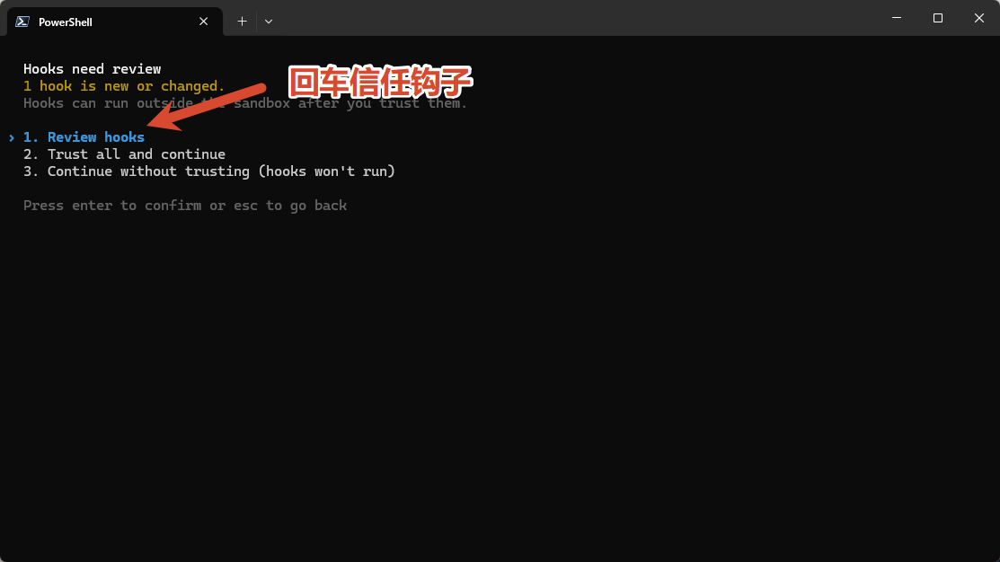
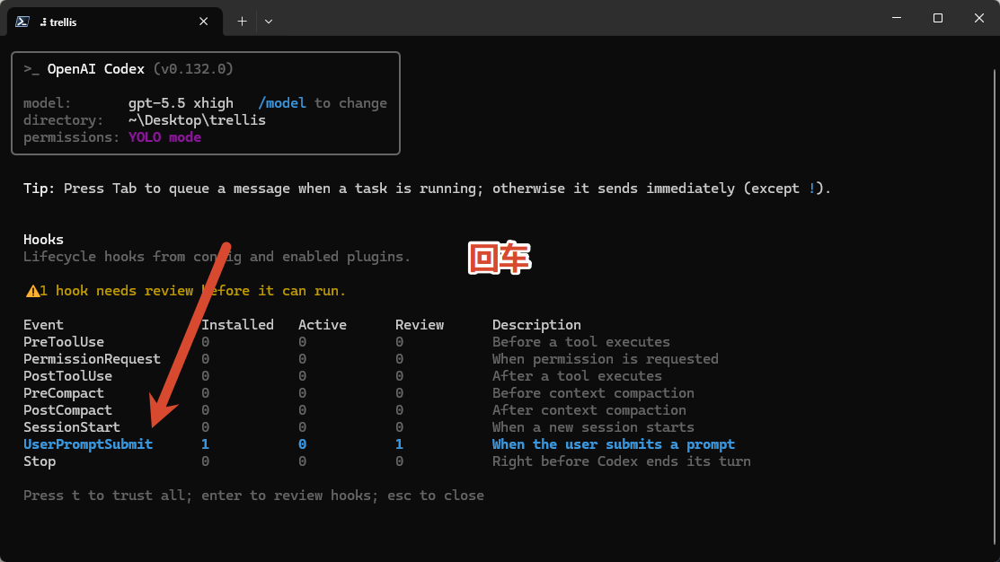
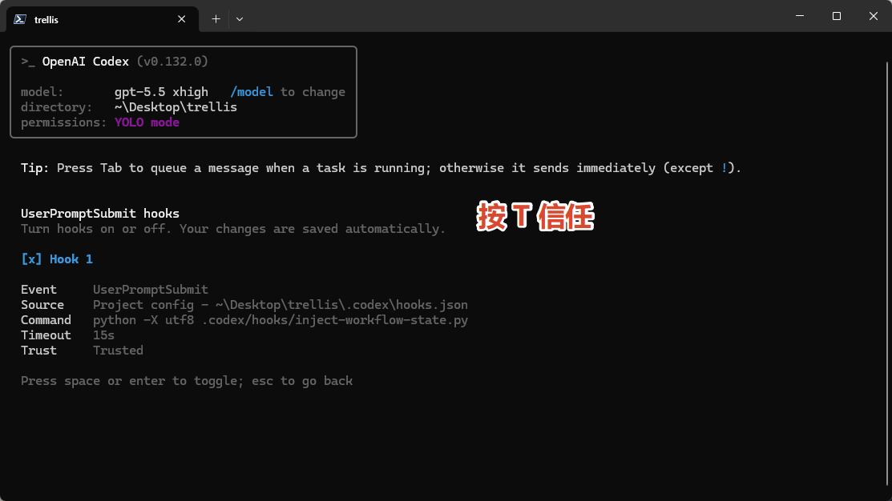

# AI 编程工作流实战

> Claude Code + Codex + Trellis 项目记忆框架 · 客户专属教学资料

这是一门**实战课**，不是入门科普。看完跟着做完，你能：

- 让 Claude Code / Codex 在同一个真实项目里连续工作几天甚至几周，不会因为换会话就丢上下文
- 掌握"建项目 → 写规范 → 拆需求 → 写代码 → 自检 → 手测 → 提交 → 收尾"的标准小闭环
- 在出 bug、加功能、续工三种最常见场景下，知道怎么向 AI 提问最有效

## 课程入口

| 文件 | 用途 | 建议先看 |
|---|---|---|
| [实战教程.html](./实战教程.html) | 9 课主线，从概念到实战演练，单文件离线可读 | ⭐ 先看这个 |
| [AI编程工作流-新项目速查.pdf](./AI编程工作流-新项目速查.pdf) | 起一个全新项目时的速查 PDF，可打印随手翻 | 起项目时再翻 |

打开方式：直接双击 `实战教程.html`，浏览器即可阅读，无需任何依赖。

## 如果遇到 Codex Hook 信任弹窗

按下面三张图的顺序操作即可，这是当前最新流程。

### 第一步

### 第二步

### 第三步

## 仓库里其它东西是什么

| 路径 | 你需要看吗 |
|---|---|
| `.trellis/` | 课程演示时生成的 Trellis 运行时文件，可作为参考实例 |
| `.claude/` / `.codex/` / `.agents/` | Claude Code 和 Codex 接入 Trellis 后生成的平台配置 |
| `AGENTS.md` | Trellis 写给 AI 看的跨平台入口；自己开新项目时会重新生成 |
| `project.yaml` | 课程元数据，可忽略 |

⚠️ 这些是**示例**，不要直接拷贝到你自己的项目。每个新项目都要走 `trellis init` 重新生成一份属于自己的。

## 课程怎么学

1. 先把 `实战教程.html` 第 1-4 课读完，理解概念和工具差别
2. 第 5 课跟着做一遍 Todo 实战，跑通完整 0→1 闭环
3. 之后任何新项目，按 `AI编程工作流-新项目速查.pdf` 起手
4. 卡住时回查第 7 课提示词模板、第 8 课命令速查、第 9 课 FAQ

## 适合谁

- 已经会用 Claude / Codex 聊天写代码，但 AI 总是"健忘"
- 想做一个能持续迭代的真实项目，而不只是一次性脚本
- 不想反复跟 AI 解释"这个项目是干嘛的、你之前说过什么"

## 不适合谁

- 完全没用过命令行（请先掌握 `cd`、`ls`、`git` 基本操作）
- 只想问一个一次性问题，不打算建项目

---

遇到问题随时找我；课程会随 Trellis / Claude / Codex 版本更新持续维护。
